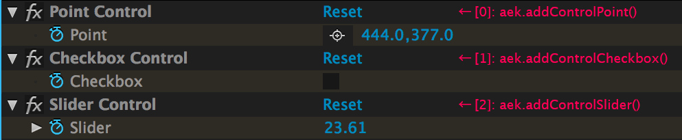

ofxAEKeyframe
==============


An addon and example that allows you to encode oF animations into Adobe After Effects's keyframe data. It can be pasted to AE's layer with Expression Control Effect.

NOTE: This addon is under development. It makes the app heavier gradually and perhaps raises some errors or problems in your environment :'(

麦 (Baku) [http://baku89.com](http://baku89.com)

## Getting Started

The following code quoted from **example-Basic**:

1. Add ofxAEKeyframe instance to ofApp class.

	```cpp
	ofxAEKeyframe aek;
	```

1. In `setup()`, initialize instance.

	```cpp
	aek.setFPS(29.97);
	aek.addControlPoint();		// 0: mouse position
	aek.addControlCheckbox();	// 1: is mouse pressed
	aek.addControlSlider();		// 2: audio input volume
	```

3. Add keyframes for each frame in `update()`.

	```cpp
	aek.appendFrame();
	aek.addKey(0, ofVec2f(ofGetMouseX(), ofGetMouseY()));
	aek.addKey(1, ofGetMousePressed());
	aek.addKey(2, curtVol);
	```

This keyframes are pasted like this condition.




## Lisence
ofxAEKeyframe is published under a MIT License. See the included LISENCE file.

## Compatibility

I tested my following environment.

* openFrameworks v0.8.4
* Adobe After Effects CC 2014
* Mac OS X 10.10

## TODO

* optimize all the code so that does not make the app heavier
* support older version of AE
* support Angle Control Effect
* support easing for each keyframes

I'm waiting for your contribution!
